<div align="center">

```
████████╗███████╗██████╗ ███╗   ███╗██╗███╗   ██╗ █████╗ ██╗
╚══██╔══╝██╔════╝██╔══██╗████╗ ████║██║████╗  ██║██╔══██╗██║
   ██║   █████╗  ██████╔╝██╔████╔██║██║██╔██╗ ██║███████║██║
   ██║   ██╔══╝  ██╔══██╗██║╚██╔╝██║██║██║╚██╗██║██╔══██║██║
   ██║   ███████╗██║  ██║██║ ╚═╝ ██║██║██║ ╚████║██║  ██║███████╗
   ╚═╝   ╚══════╝╚═╝  ╚═╝╚═╝     ╚═╝╚═╝╚═╝  ╚═══╝╚═╝  ╚═╝╚══════╝
                          Q U E S T   C L I
```

**An RPG that lives entirely in your terminal — bilingual, themeable, zero-config.**

[](https://www.npmjs.com/package/terminal-quest-cli)
[](https://www.npmjs.com/package/terminal-quest-cli)
[](./LICENSE)
[](https://github.com/Ricardo-M-L/terminal-quest-cli/actions/workflows/ci.yml)
[](https://nodejs.org)
[](#cross-platform-notes)
[](https://packagephobia.com/result?p=terminal-quest-cli)
[](https://nodejs.org)

</div>

<div align="center">



### Try it right now — no install needed

```bash
npx terminal-quest-cli
```

</div>

> **TL;DR** A terminal-native RPG with hidden files, NPCs, day/night cycle,
> 8 minigames, multi-slot saves and a bilingual UI. One command,
> zero config, no GUI dependencies. Plays in any modern terminal on macOS,
> Linux and Windows.

---

## What does it look like?

A live shot from a fresh `npx terminal-quest-cli` session — the full
40-line script lives in [`docs/session-transcript.md`](./docs/session-transcript.md):

```text
$ npx terminal-quest-cli

[BIOS v2.1 - KIMI-OS]
[ok] Memory check
[ok] Initializing AI core
[ok] Mounting virtual file system
System ready.

  > Core modules loaded
  > Type "help" to start your adventure

[🌅 06:00] [Lv.1] explorer@kimi-os:~$ scan
[scan] revealing hidden entries...
  .secret/    .keychain    .diary.bak

[🌅 08:00] [Lv.1] explorer@kimi-os:~$ cd /world/lab
[🌅 09:00] [Lv.1] explorer@kimi-os:/world/lab$ talk technician
technician (neutral): "If you came for the prototype, you'll need to behave."
  > [1] "I just want to look around."   (kindness +1)
  > [2] "Move aside."                    (ruthless +1)

[🌅 09:00] [Lv.1] explorer@kimi-os:/world/lab$ run morse
Morse decode — Decode the message (single word). Type q to quit.

  -.- .. -- ..

answer 1/3 (or 'hint'): KIMI
decoded!  +80 EXP

*** ACHIEVEMENT UNLOCKED ***
  +-------------------------+
  | 📡  Morse Master        |
  | Decode without hints    |
  +-------------------------+

[☀️ 12:00] [Lv.2] explorer@kimi-os:/world/lab$ cd /shadow/archive
The archive doors are sealed during daylight.
  tip: try `wait` to advance the day/night cycle.

[☀️ 12:00] [Lv.2] explorer@kimi-os:/world/lab$ wait 6
time advances... 19:00 (Night)
*** ACHIEVEMENT UNLOCKED ***  🦉  Night Owl

[🌙 19:00] [Lv.2] explorer@kimi-os:/shadow/archive$ share
share card written: ~/.terminal-quest/shares/card-explorer-2026-04-25T11-21-00Z.txt
```

> A real asciinema recording will live at
> [`docs/demo.cast`](./docs/demo.cast.placeholder) once captured by the
> next release maintainer — the placeholder file documents the exact
> `asciinema rec` command.

---

## Why another text adventure?

There are dozens of text adventures on npm. Three things make this one
worth the 30 seconds:

1. **Truly zero-config — `npx terminal-quest-cli` and you're playing.**
   No setup, no install prompts, no GUI dependency, no Electron. Three
   transitive deps (`chalk`, `figlet`, `keypress`), all popular and
   audited.
2. **Bilingual + themeable from day one.** English / 中文 switchable at
   runtime, three palettes (`dark` / `light` / `retro` amber-CRT). Other
   text adventures bolt i18n on later or never.
3. **Multi-slot saves with `schemaVersion` migration + 6 unique
   minigames + NPC mood branching.** Save schema is documented and
   versioned, so old saves keep loading after upgrades. Minigames go
   beyond `guess the number` — Wordle clone, logic-circuit SAT solver,
   morse decoder, reaction QTE, snake, pong, matrix rain.

---

## Features

| | | |
|---|---|---|
| 🏆 **34 achievements** in 6 categories | 🌐 **Bilingual UI** (en / zh) | 🎨 **3 themes** (dark / light / retro) |
| 💾 **Multi-slot saves** with schema migration | 🗣️ **NPC mood branches** (kind / neutral / hostile) | 🎮 **8 minigames** with EXP rewards |
| 🌅 **Day / night cycle** + phase-gated areas | 📇 **Shareable ASCII score cards** | 🪟 **Runs on macOS / Linux / Windows** |

Plus: shell-style `alias` / `unalias` / `history` / `!!`, tab-completion
helper, in-game `tree` / `find` / `grep`, hidden easter-egg commands,
verbose `--dev` log mode, and a CI matrix on Node 18 / 20 / 22 across all
three OSes.

---

## Install

```bash
# Try once, no install (recommended for first-timers)
npx terminal-quest-cli@latest

# Install globally so `terminal-quest`, `tq`, `adventure` are on your PATH
npm install -g terminal-quest-cli
terminal-quest                 # or: tq / adventure

# Hack on the source
git clone https://github.com/Ricardo-M-L/terminal-quest-cli.git
cd terminal-quest-cli
npm install && npm test
npm start
```

`npx terminal-quest-cli@latest` always runs the freshest published
version — handy for grabbing fixes without a global re-install.

---

## Usage

Once the game starts, explore with familiar Unix-style commands. The
full reference is in [`docs/COMMANDS.md`](./docs/COMMANDS.md); this is
the cheat sheet:

| Category   | Commands                                                                 |
| ---------- | ------------------------------------------------------------------------ |
| Navigation | `ls`, `ls -a`, `cd <dir>`, `pwd`, `tree`, `map`                          |
| Inspect    | `cat <file>`, `scan`, `find <name>`, `grep <text>`, `analyze`            |
| Progress   | `status`, `inventory`, `quests`, `achievements`, `share`                 |
| Interact   | `talk <npc> [choice]`, `use <item>`, `decode <file>`, `unlock master`    |
| Play       | `run snake / guess / matrix / pong / wordle / qte / logic / morse`        |
| Time       | `wait [n]`, `sleep`, `time`, `look`                                       |
| Shell      | `alias name=val`, `unalias`, `history`, `!!`, `!<n>`, `complete <prefix>` |
| Meta       | `save [slot]`, `load <slot>`, `saves`, `lang en\|zh`, `theme dark\|light\|retro`, `help`, `exit` |
| Fun        | `matrix`, `love`, `coffee`, `42`, `hello`, `sudo`, `easteregg`            |

### CLI flags

| Flag                | Description                                          | Example                                |
| ------------------- | ---------------------------------------------------- | -------------------------------------- |
| `--slot <name>`     | Load or create a named save slot on startup.         | `terminal-quest --slot alice`          |
| `--lang <en\|zh>`   | Force a UI language.                                 | `terminal-quest --lang en`             |
| `--theme <name>`    | Pick a theme: `dark`, `light`, `retro`.              | `terminal-quest --theme retro`         |
| `--no-boot`         | Skip the BIOS animation.                             | `terminal-quest --no-boot`             |
| `--dev`             | Enable verbose dev logging.                          | `terminal-quest --dev`                 |
| `--version`         | Print the package version and exit.                  | `terminal-quest --version`             |
| `--help`            | Show CLI help.                                       | `terminal-quest --help`                |

---

## Save locations

```
~/.terminal-quest/
├── saves/
│   ├── default.json
│   ├── alice.json
│   └── speedrun.json
└── shares/
    └── card-<handle>-<timestamp>.txt
```

Saves are plain JSON wrapped in `{ schemaVersion, slot, savedAt, state }`
— see [`docs/SAVE_FORMAT.md`](./docs/SAVE_FORMAT.md). The loader
auto-migrates the legacy `~/.terminal-quest-save.json` single-file save,
so upgrading never nukes progress.

---

## Cross-platform notes

- **macOS / Linux** — works in any modern terminal (Terminal, iTerm2,
  Alacritty, Kitty, gnome-terminal, kitten).
- **Windows** — works in Windows Terminal and PowerShell. `cmd.exe`
  works too, but ANSI 24-bit hex colours fall back to the nearest 16
  colours via `chalk`'s autodetect; the retro CRT palette will look
  amber-ish rather than spot-on `#FFB000`.
- **CI / piped stdout** — boot animation, spinners, progress bars and
  scan effect all detect non-TTY and degrade to a single static line.

---

## i18n

| Code | Language |
| ---- | -------- |
| `en` | English  |
| `zh` | 中文     |

Switch with `lang en` / `lang zh` in-game or `--lang` on startup. New
language packs only need to implement the keys in `src/i18n.js`.

## Themes

Bundled palettes live in `src/themes.js`:

- `dark` (default) — green / cyan / magenta on black
- `light` — same hues, darker shades for white-on-light terminals
- `retro` — amber monochrome, classic CRT vibes

Switch with `theme retro` in-game or `--theme retro` on startup. Custom
themes are just an object of `chalk` color names / hex values.

---

## Roadmap

- [ ] Record `docs/demo.cast` and embed it at the top of this README
- [ ] Publish 1st-class `tq` completions for bash / zsh / fish
- [ ] Mod API for third-party quests and zones
- [ ] More language packs (ja, fr, es)
- [ ] Cloud-save adapter (optional, opt-in)

## Contributing

Issues, PRs and new quest ideas are warmly welcome. Please read
[`CONTRIBUTING.md`](./CONTRIBUTING.md) first; this project follows the
[Contributor Covenant](./CODE_OF_CONDUCT.md).

For security issues, please see [`SECURITY.md`](./SECURITY.md) and do
**not** open a public GitHub issue.

For maintainers cutting a release: [`docs/RELEASING.md`](./docs/RELEASING.md).

## License

[MIT](./LICENSE) © KIMI-AI and contributors.

## Stars over time

[](https://starchart.cc/Ricardo-M-L/terminal-quest-cli)

---

## 中文速览

一款完全跑在终端里的 RPG 冒险游戏。中英双语、多槽位存档、可切换主题、
8 个小游戏、34 个成就、12 条主线任务、昼夜循环 + NPC 心情分支对话。

### 一行启动

```bash
npx terminal-quest-cli
```

### 安装

```bash
# 全局安装
npm install -g terminal-quest-cli
terminal-quest      # 或 tq / adventure

# 源码
git clone https://github.com/Ricardo-M-L/terminal-quest-cli.git
cd terminal-quest-cli && npm install && npm start
```

### 常用命令

- 探索：`ls` / `ls -a` / `cd <目录>` / `tree` / `scan` / `find <名字>` / `grep <文本>`
- 角色：`status` / `inventory` / `quests` / `achievements` / `share`
- 互动：`talk <npc> [选项]` / `use <物品>` / `decode <文件>` / `unlock master`
- 小游戏：`run snake|guess|matrix|pong|wordle|qte|logic|morse`
- 时间：`wait [n]` / `sleep` / `time` / `look`
- Shell：`alias name=val` / `unalias` / `history` / `!!` / `!<n>` / `complete <prefix>`
- 系统：`save [槽位]` / `load <槽位>` / `saves` / `lang` / `theme` / `help` / `exit`

### 存档位置

- 新格式：`~/.terminal-quest/saves/<slot>.json`
- 分享卡：`~/.terminal-quest/shares/`
- 旧版单文件存档会自动迁移到 `default` 槽位。

### 通关目标

找到 3 块密钥碎片（`AW4K3`、`_TH3_`、`4I`），合成主密钥
`AW4K3_TH3_4I`，输入 `unlock master` 解锁最终秘密。
